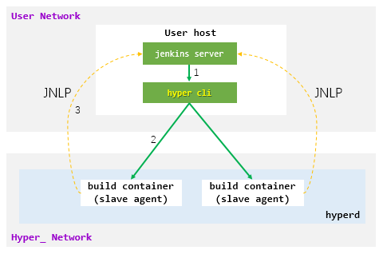
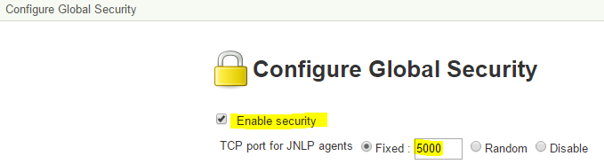
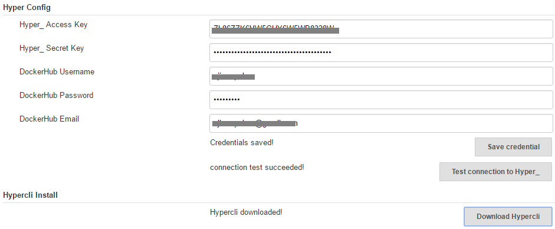
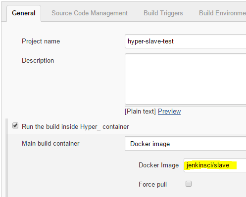
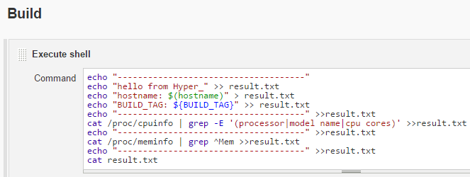
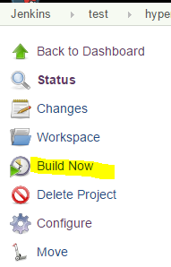
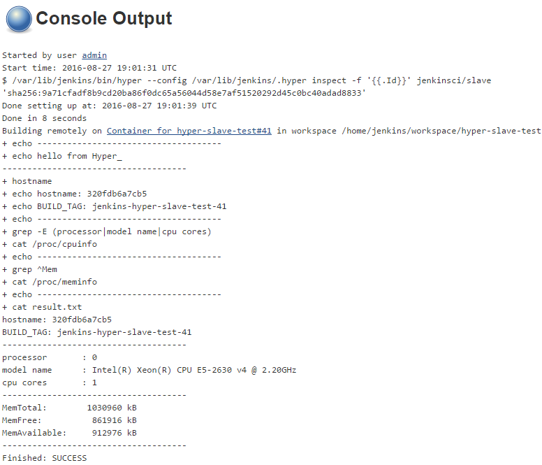
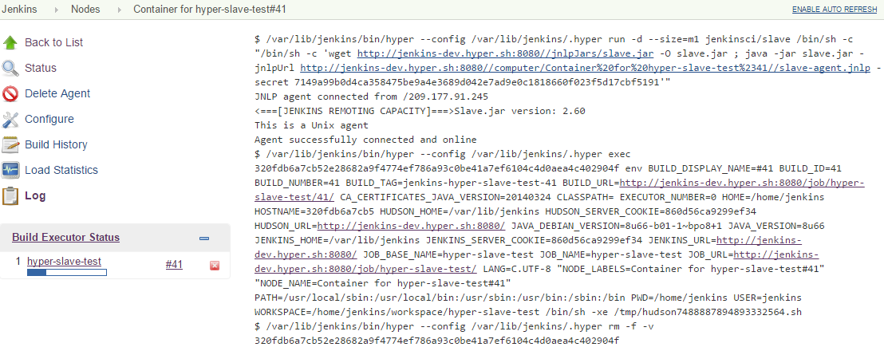
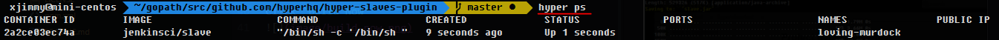
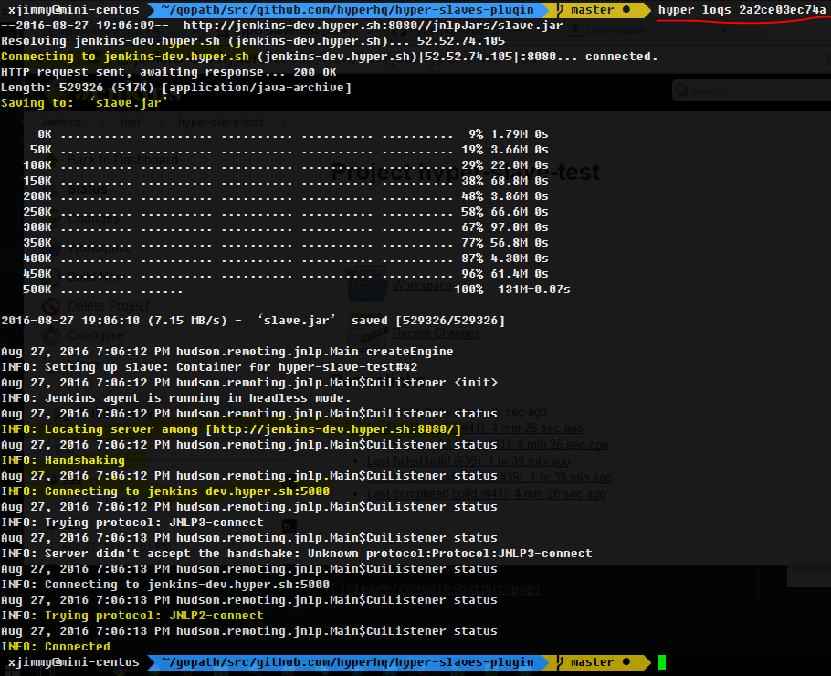

Hyper_ Slaves Plugin For Jenkins
================================

This plugin allows to execute a jenkins job inside [`Hyper_`](https://hyper.sh) container(s).

<!-- TOC depthFrom:1 depthTo:6 withLinks:1 updateOnSave:1 orderedList:0 -->

- [Architecture](#architecture)
- [Dependency](#dependency)
- [Usage](#usage)
	- [Config](#config)
		- [Enable JNLP](#enable-jnlp)
		- [hyper-commons-plugin Configuration](#hyper-commons-plugin-configuration)
		- [Job Configuration](#job-configuration)
	- [Start Build](#start-build)
	- [View Log](#view-log)
		- [View Build Result](#view-build-result)
		- [View Slave node log](#view-slave-node-log)
		- [View build container](#view-build-container)

<!-- /TOC -->

# Architecture


# Dependency
- [hyper-commons-plugin](https://github.com/jenkinsci/hyper-commons-plugin)
- Hyper_ credential (get from https://console.hyper.sh)
- Jenkins Server should have `public ip`
- build image should contain `wget`/`curl` and `java`
  - `wget`/`curl`(optional): download slave.jar from jenkins master. This ensures that slave agent version matched with the master. Download will be skipped when wget/curl is missing.
  - `java`(required): run slave agent(slave.jar) to connect Jenkins master through JNLP.

# Usage

## Config

### Enable JNLP
```
Manage Jenkins -> Configure Global Security
  -> Enable security: checked
  -> TCP port for JNLP agents: Fixed 5000
```



### hyper-commons-plugin Configuration
```
Manage Jenkins -> Configure System -> Hyper Config
  -> Access Key
  -> Secret Key

Manage Jenkins -> Configure System -> Hypercli Install
  -> Download Hypercli
```



### Job Configuration

Select build image(`Recommended Container Size: >=S2` )  


Add build step  


## Start Build
Click `Build Now`  


## View Log

### View Build Result


### View Slave node log


### View build container




